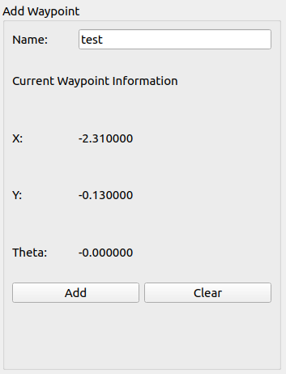
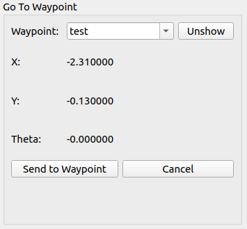
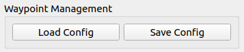

# custom_rviz_plugins

This repo is to be used as a baseline for developing custom tools and panels on RVIZ. The current content developed in this repo is developed for the use case of providing robots running movebase with an open-sourced User Interface build into RVIZ.

## Pre-requisites
- `master` branch   : Runs on ROS Melodic and above with rviz 
- `ROS2` branch     : Runs on ROS Foxy and above with rviz

## Installation
This package should be placed in the workspace with the rest of the robot's codes 

```
cd ~/<desired workspace>/src
git clone
cd ~/<desired workspace> && source /opt/ros/<ROS1 Distro>/setup.bash 
catkin_make
```

## Usage
This repo is meant to enhance rviz by implementing additional tools and panels into its resources. The following segment will explain and showcase tools and panels currently available in this repo

### 1) AddPose Tool
This tools inherits the `rviz::PoseTool` class, which is also used in the `2D estimate` tool. The `AddPose` tool will display the name `setPosition` in rviz. This tool publishes the selected position and orientation at the position as a rostopic `clicked_pose`. The rostopic can be changed from the source code, `add_pose_tool.cpp`.

This tool will be heavily used for the Robot UI Panel.


### 2) RobotUI Panel
This panel inherits the `rviz::Panel` class and will be used as the main User Interface(UI) for all desired custom features for the UI. Currently, there are 3 parts to the UI.

(1) Add Waypoint:
This part subscribes to the rostopic `clicked_pose` from the `AddPose` Tool above. Upon receiving a message, this section will display the x, y postion as well as the orientation of the position in radians. The position can be saved to a name in this section as well.  The position will only be saved when a name is given to it.    




(2) Go To Waypoint:
This section will allow the user to select saved waypoints to go to via the movebase action client server as a `sendGoal` command. The section will also display the selected waypoint's main information, such as the x, y coordinates as well as the orientation in euler angle. The selected waypoint can also be visualised over the robot map with the `show/unshow` button. However, in order for this to work, under the `Display` panel, a subscriber to `Marker` topics must be added. Lastly, this section also has a `cancel task` button, which is to enable the user to cancel ongoing robot navigation task.




(3) Waypoint Management:
This section enables the user to save all waypoints as a `.yaml` file, as well as loading pre-saved waypoints from a `.yaml` file.

